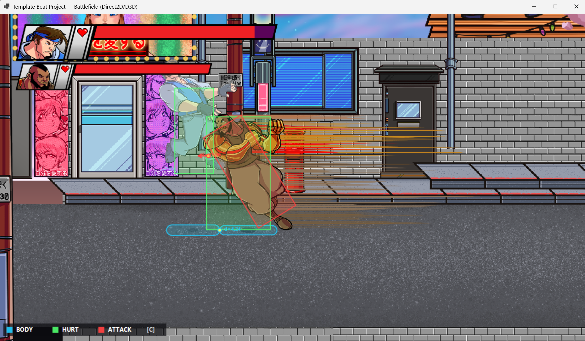

# ArcCollision



ArcCollision is a **deterministic 2D collision-query library** for arcade action games, fighting games, and beat 'em ups. Its goal is to provide predictable collision results on Windows, Linux, macOS, Android, and iOS while keeping latency, managed allocation, and integration overhead low enough for a game loop.

Its defining feature is lockstep-friendly collision geometry: the C# reference backend and the C++ native backend share an explicitly quantized integer model and are designed and regression-tested for bit-level behavioral parity. ArcCollision provides shape tests, manifolds, continuous casts, spatial queries, and a collision world; it is not a rigid-body dynamics or constraint solver.

## Contents

- [1. Design](#1-design)
  - [Two implementations, one behavior contract](#two-implementations-one-behavior-contract)
  - [Precision contract](#precision-contract)
  - [Lockstep and frame synchronization](#lockstep-and-frame-synchronization)
  - [Collision pipeline](#collision-pipeline)
  - [Native implementation and platforms](#native-implementation-and-platforms)
- [2. Performance](#2-performance)
  - [QueryBatch](#querybatch)
- [3. API Usage](#3-api-usage)
  - [Select a C# backend](#select-a-c-backend)
  - [Create a World, configure layers, and compute contacts](#create-a-world-configure-layers-and-compute-contacts)
  - [Query, QueryBatch, and exact overlap](#query-querybatch-and-exact-overlap)
  - [ShapeCast](#shapecast)
  - [C ABI](#c-abi)
  - [Build and test](#build-and-test)

## 1. Design

### Two implementations, one behavior contract

| Project | Role |
| --- | --- |
| [`ArcCollision.Ref`](./ArcCollision.Ref) | Pure C# reference implementation and the behavioral source of truth. |
| [`ArcCollision`](./ArcCollision) | C++17 implementation exposed through the single public C header [`arccollision.h`](./ArcCollision/arccollision.h). |
| [`ArcCollision.Wrapper`](./ArcCollision.Wrapper) | C# P/Invoke layer whose public API mirrors `ArcCollision.Ref`. |
| [`ArcCollision.Tests`](./ArcCollision.Tests) | Reference tests, cross-backend bit-parity tests, and regression hashes. |
| [`Visualizer`](./Visualizer) | Interactive collision and sweep debugger. |
| [`Battlefield`](./Battlefield) | Playable sample using body, hurtbox, hitbox, trigger, and stage collision. |

The reference and native implementations contain the same fixed-point collision, sweep, dynamic AABB tree, static BVH, filtering, and result-ordering rules. Switching a C# game between them normally requires only a namespace change.

### Precision contract

Public APIs use `float` for convenience, but values are range-checked and quantized at the authoritative boundary. Collision decisions and published geometry are determined by the following integer representations:

| Quantity | Authoritative representation | Internal step |
| --- | --- | ---: |
| Positions, radii, extents, contact points, and penetration depth | Q24.8 | `1 / 256` world unit (`0.00390625`) |
| Uniform Transform scale | Q16.16 | `1 / 65,536` (`0.0000152587890625`) |
| Sweep and segment parameters | Q16.16 | `1 / 65,536` of the supplied motion |
| Rotation | `Angle32`, one turn over `UInt32` | `1 / 2^32` turn, about `0.0000000838°` |
| Unit-normal components | Internal Q1.30 axis | `1 / 2^30`, about `9.31e-10`; published as `float` |

World-space inputs are rounded to the nearest representable cell with an explicitly defined rule. Every collider position and extent-derived bound must remain within `+/-1,953,125` world units. Inputs outside the supported range are rejected instead of overflowing into a different collision result.

These are the authoritative integer grids, not a claim that an IEEE-754 `float` can display every grid cell at every magnitude. Near ordinary gameplay coordinates, spatial results expose the full `1/256` grid. At very large coordinates, public float spacing becomes coarser even though the internal collision state remains Q24.8; `ShiftOrigin` is available for large worlds that need local float precision. Normal calculations use Q1.30 internally and are rounded to the nearest representable float only when published.

`Transform` is quantized before it is composed or applied to a collider. Position, `Angle32.Raw`, and uniform scale therefore become deterministic state before World materialization; no authoritative shape transform is performed with platform-dependent floating-point math.

The practical consequence is deliberate: contact points and depths are resolved on a `1/256` world-unit grid, cast times on a `1/65,536` motion grid, and both backends use the same quantization and tie-breaking contract for the same input state.

### Lockstep and frame synchronization

ArcCollision is designed to be the deterministic collision subsystem inside a lockstep or rollback game. For a fixed library version and backend, given all of the following:

- identical shape data, filters, `Angle32.Raw` values, and Transform input bits;
- the same fixed-timestep call sequence;
- the same collider add/remove order and enabled state; and
- single-threaded access to each World;

the World produces deterministic handles, ordered broadphase candidates, collision decisions, manifolds, casts, and contact-frame state. Integer tie-breaking and explicit result sorting are used wherever traversal order could otherwise leak into public behavior.

The C# and native backends share exact-bit regression cases and locked scenarios that hash every published result bit. The same deterministic World scenario is locked to hash `2644972881` in both the managed and C API test suites. Broader parity tests also enforce tightly bounded grid-level agreement. This is a strong regression contract, but not an unconditional promise that every possible manifold or convenience output will be bit-identical across arbitrary backend, compiler, and platform combinations. Strict lockstep peers should use the same library version and backend, and validate the locked hashes on every target platform included in the session.

The game still owns networking, input synchronization, frame stepping, snapshots, rollback, and deterministic gameplay state. In particular, independently integrated floating-point movement can diverge before it reaches ArcCollision. Lockstep projects should synchronize quantized state—or guarantee identical IEEE-754 input bits—and perform World mutations in the same order. Synchronize `Angle32.Raw` directly instead of independently converting radians on each peer. Matching handles and `PairId` values also requires the same collider add/remove lifecycle.

Collision decisions, sweep time, and sweep normal are integer-derived. Some published convenience values, such as a reconstructed `SweepHit.Point` on particular relative fast paths, cross back through float arithmetic; re-quantize such values before feeding them into authoritative gameplay state.

The C# World also provides opt-in contact-frame tracking. One `ComputePairs` call defines one collision frame; a successful `TryComputeContact` records persistence, `ContactPair.Frame == 1` marks an enter event, `Frame > 1` marks a stay, and contact after a separation starts again at 1. The tracker does not emit leave events; compare the current and previous sets of contact IDs when leave notification is required. This state is disabled by default and remains deterministic when every peer evaluates the same contacts at the same simulation cadence.

### Collision pipeline

Supported shapes are `Circle`, `Aabb`, `Obb`, `Capsule`, and convex or concave `Polygon`. Concave polygons are triangulated when their immutable geometry is created, then processed as convex pieces at runtime.

World work is split into two stages:

1. Dynamic colliders enter a fat-margin dynamic AABB tree; static colliders enter a SAH static BVH.
2. The broadphase publishes candidate `ArcHandle` or `CandidatePair` values, and the caller requests exact overlap or manifold work only where needed.

`ComputePairs` produces dynamic-dynamic and dynamic-static candidates, never static-static pairs. `Query` and `QueryBatch` return bounds candidates rather than exact shape intersections; call `TryComputeContact` when exact overlap is required.

Each collider owns 32-bit `Categories` and `CollidesWith` masks. There is no global layer matrix. Both colliders must accept the relationship:

```text
(A.Categories & B.CollidesWith) != 0 &&
(B.Categories & A.CollidesWith) != 0
```

`ManifoldFields` selects narrowphase detail and cost:

| Mode | Work performed |
| --- | --- |
| `None` | Boolean collision only. |
| `NormalDepth` | Collision normal and penetration depth, without a contact point. |
| `All` | Complete manifold. |

These are mutually exclusive detail modes, not combinable flags. A manifold normal points from A toward B; moving A by `-Normal * Depth` separates A from B.

Continuous collision includes ray casts, specialized primitive sweeps, and translation-only `ShapeCast` for every Shape pairing. `SweepHit.Time` is in `[0, 1]` along the supplied motion.

### Native implementation and platforms

- Desktop x86/x64 requires SSE4.2; ARM targets require ARM64 NEON. ARMv7 is not supported.
- Supported targets include Windows, Linux, macOS, Android arm64, and iOS arm64.
- SIMD is confined to integer hot paths and does not change the floating-point API boundary or C ABI.
- Native pair/query/cast-all functions publish world-owned borrowed views, avoiding a count call followed by a second execution of the operation.
- The Wrapper uses reusable unmanaged scratch storage and caller-owned `List<T>` results. After capacity warmup, query paths do not create temporary managed arrays.
- World access is not internally synchronized. Callers must use a World from one thread at a time or provide external synchronization.

## 2. Performance

The following Release measurements were taken on 2026-07-21 on an AMD Ryzen 7 5800X3D running Windows x64 and .NET 8.0.28. The benchmark is single-threaded and uses seed `0xA11CE5EED`. Only the benchmark thread is pinned to logical CPU 2 and raised to the highest thread priority; the process, GC, finalizer, and tiered-JIT workers keep their normal affinity and priority.

The world contains 1,500 static and 750 dynamic colliders and runs for 120 frames. Every frame:

1. updates every dynamic collider Transform;
2. computes dynamic-dynamic and dynamic-static candidates;
3. runs `TryComputeContact(..., ManifoldFields.All)` for every candidate; and
4. hashes pair identities and the complete manifold output.

Values below are medians from one complete process invocation with 3 warmup and 9 measured trials:

| Metric | `ArcCollision.Ref` | `ArcCollision.Wrapper` | Wrapper vs. Ref |
| --- | ---: | ---: | ---: |
| World construction | 1.97 ms | 1.65 ms | **1.19x** |
| Total simulation time for 120 frames | 1471.09 ms | 548.54 ms | **2.68x** |
| Time per frame | 12.259 ms | 4.571 ms | **2.68x** |
| Dynamic collider-frames processed by the complete workload | 61,179/s | 164,072/s | **2.68x** |
| Managed allocation per trial | 1.31 MiB | 208 B | Substantially lower |

Each trial processes 637,732 candidate pairs and 476,268 actual collisions. Both backends produce checksum `0x46D2D4B38370D858`; the benchmark refuses to report performance if candidate counts, collision counts, or result hashes differ.

The measured simulation-time relative IQR was 0.70% for Ref and 1.35% for Wrapper. Candidate counts, collision counts, and the checksum are deterministic validation values and should match exactly. Wall-clock timings are machine-state-dependent samples and are not expected to match digit for digit, even with the same seed and command.

### QueryBatch

The following medians submit 16,384 queries to the same world. `Native-loop` performs one native Query call per shape; `Native-batch` submits the entire set through one P/Invoke call. `Nat/Ref` and `Batch/Ref` are speedups calculated as Ref-loop time divided by the corresponding native time, so values above `1x` mean native is faster.

| Query distribution | Ref-loop | Native-loop | Native-batch | Nat/Ref | Batch/Ref |
| --- | ---: | ---: | ---: | ---: | ---: |
| Sparse: scattered with almost no hits | 1.348 ms | 1.551 ms | 1.204 ms | **0.87x** | **1.12x** |
| Dense: each query placed near a collider | 35.816 ms | 27.322 ms | 22.147 ms | **1.31x** | **1.62x** |
| Coherent: each group of four is spatially adjacent | 32.345 ms | 24.491 ms | 21.699 ms | **1.32x** | **1.49x** |

All three Query paths report `0 B/query` of managed allocation after capacity warmup. In an extremely sparse workload, each traversal is already very cheap, so batch input packing can leave native batch near parity with Ref. Dense and spatially coherent workloads provide more opportunity for batched traversal to pay off.

Actual performance depends on CPU, compiler, power and thermal state, background load, shape mix, candidate density, and fat margin. Treat the table as a dated comparison snapshot rather than a cross-device performance guarantee.

Reproduce the full benchmark:

```powershell
cd ArcCollision
cmake --preset windows-x64 --fresh
cmake --build --preset windows-x64
cd ..

dotnet run --project ArcCollision.Benchmarks -c Release -- `
  --seed 0xA11CE5EED --static 1500 --dynamic 750 --frames 120 `
  --iterations 9 --warmup 3 --sample-ms 200 --fat-margin 4 --cpu 2
```

Use `--quick` only for a shorter functional smoke run. Its managed timings may still include lower JIT tiers and should not be compared with the full benchmark table.

## 3. API Usage

### Select a C# backend

The two C# backends use the same public type names and parameter order. A direct switch only changes the namespace:

```csharp
// Pure C# reference implementation
using ArcCollision.Ref;

// Or use the C++ native backend
// using ArcCollision.Wrapper;
```

A project can centralize the choice so gameplay files do not know which backend is active:

```csharp
#if ARCCOLLISION_NATIVE
global using ArcCollision.Wrapper;
#else
global using ArcCollision.Ref;
#endif
```

The Wrapper also requires the matching `arccollision.dll`, `libarccollision.so`, or `libarccollision.dylib` in the application output or RID native-asset directory. On iOS, link the static library into the main program and resolve it through `__Internal`.

### Create a World, configure layers, and compute contacts

```csharp
using ArcCollision.Wrapper;

const uint Player      = 1u << 0;
const uint Enemy       = 1u << 1;
const uint Environment = 1u << 2;

var playerFilter = new CollisionFilter(Player, Enemy | Environment);
var enemyFilter = new CollisionFilter(Enemy, Player | Environment);
var environmentFilter = new CollisionFilter(Environment, Player | Enemy);

using var world = new ArcWorld(new ArcWorldOptions(
    fatMargin: 4f,
    initialColliderCapacity: 256,
    initialPairCapacity: 1024));

world.AddStatic(
    100,
    new Aabb(new Vec2(0, -2), new Vec2(20, 1)),
    environmentFilter);
world.BuildStatic();

// Shape is the immutable authored base shape; Transform places it absolutely.
ArcHandle player = world.Add(
    1,
    new Capsule(new Vec2(0, -0.5f), new Vec2(0, 0.5f), 0.5f),
    playerFilter);
ArcHandle enemy = world.Add(
    2,
    new Circle(Vec2.Zero, 0.75f),
    enemyFilter);

world.UpdateTransform(player, new Transform(new Vec2(1, 0)));
world.UpdateTransform(enemy, new Transform(new Vec2(2, 0)));

var pairs = new List<CandidatePair>();
world.ComputePairs(pairs);

foreach (CandidatePair pair in pairs)
{
    if (!world.TryComputeContact(
            pair, out ContactPair contact, ManifoldFields.All))
        continue;

    Manifold manifold = contact.Manifold;
    // manifold.Normal / manifold.Depth / manifold.Contact
}
```

After adding a group of static colliders, call `BuildStatic()` once to avoid lazily rebuilding the BVH during the first query or pair computation. `UpdateTransform` sets an absolute Transform; use `UpdateTransformDelta` to compose a relative change.

Enable contact-frame tracking when enter/stay timing is useful:

```csharp
world.TrackContacts = true;

// Each ComputePairs call defines one frame.
// contact.Frame == 1 means the pair entered this frame.
// contact.Frame > 1 means it is still colliding.
// Compare contact ID sets between frames to detect leave.
```

### Query, QueryBatch, and exact overlap

`Query` returns broadphase candidates. A common pattern is to query handles, then request a boolean-only exact test with `ManifoldFields.None`:

```csharp
Shape sensor = new Circle(new Vec2(1, 0), 5f);
var sensorFilter = new CollisionFilter(Player, Enemy);
var candidates = new List<ArcHandle>();

world.Query(sensor, sensorFilter, candidates);
foreach (ArcHandle target in candidates)
{
    if (world.TryComputeContact(
            sensor, sensorFilter, target,
            out _, ManifoldFields.None))
    {
        // sensor and target overlap exactly.
    }
}
```

Submit multiple queries at once and split the flattened result with `counts`:

```csharp
Shape[] sensors =
{
    new Circle(new Vec2(0, 0), 3f),
    new Aabb(new Vec2(8, 0), new Vec2(2, 2)),
};

var flatHits = new List<ArcHandle>();
var counts = new List<int>();
world.QueryBatch(sensors, sensorFilter, flatHits, counts);

int offset = 0;
for (int i = 0; i < sensors.Length; i++)
{
    for (int j = 0; j < counts[i]; j++)
    {
        ArcHandle candidate = flatHits[offset + j];
        // candidate belongs to sensors[i].
    }
    offset += counts[i];
}
```

Every result `List<T>` passed to an ArcWorld operation is cleared and reused.

### ShapeCast

```csharp
Shape mover = new Circle(new Vec2(-5, 1), 0.25f);
Vec2 motion = new(20, 0);

if (world.ShapeCast(mover, motion, playerFilter, out WorldCastHit closest))
{
    float time = closest.Hit.Time;       // [0, 1]
    Vec2 impactPosition = new Vec2(-5, 1) + motion * time;
    ArcHandle target = closest.Handle;
    Vec2 normal = closest.Hit.Normal;
}
```

### C ABI

C and C++ callers include only [`ArcCollision/arccollision.h`](./ArcCollision/arccollision.h). Exported functions use a C ABI, expose no STL types, and never require the caller to free a native World's result buffer.

`arc_world_compute_pairs`, `arc_world_query`, `arc_world_query_batch`, and cast-all functions return borrowed views. A view is invalidated by the next call using the same World; copy it first if another World operation is required before the results have been consumed.

See [`ArcCollision/README.md`](./ArcCollision/README.md) and [`ArcCollision.Wrapper/README.md`](./ArcCollision.Wrapper/README.md) for complete native build and deployment details.

### Build and test

The managed projects require the .NET 8 SDK. The native library requires CMake 3.20+ and a C++17 compiler.

```powershell
cd ArcCollision
cmake --preset windows-x64 --fresh
cmake --build --preset windows-x64
ctest --preset windows-x64
cd ..

dotnet test ArcCollision.Tests/ArcCollision.Tests.csproj -c Release
dotnet test ArcCollision.Tests.Wrapper/ArcCollision.Tests.Wrapper.csproj -c Release

dotnet run --project Visualizer -c Release
dotnet run --project Battlefield -c Release
```

Other platform presets and deployment paths are documented in the native and Wrapper subproject READMEs. ArcCollision is available under the [MIT License](./LICENSE).
